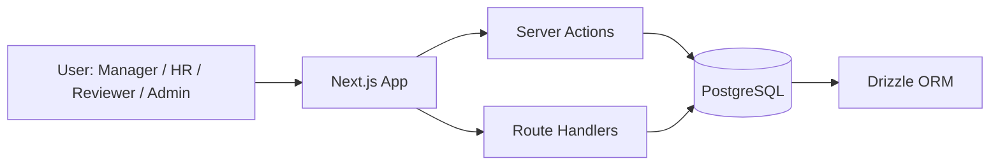
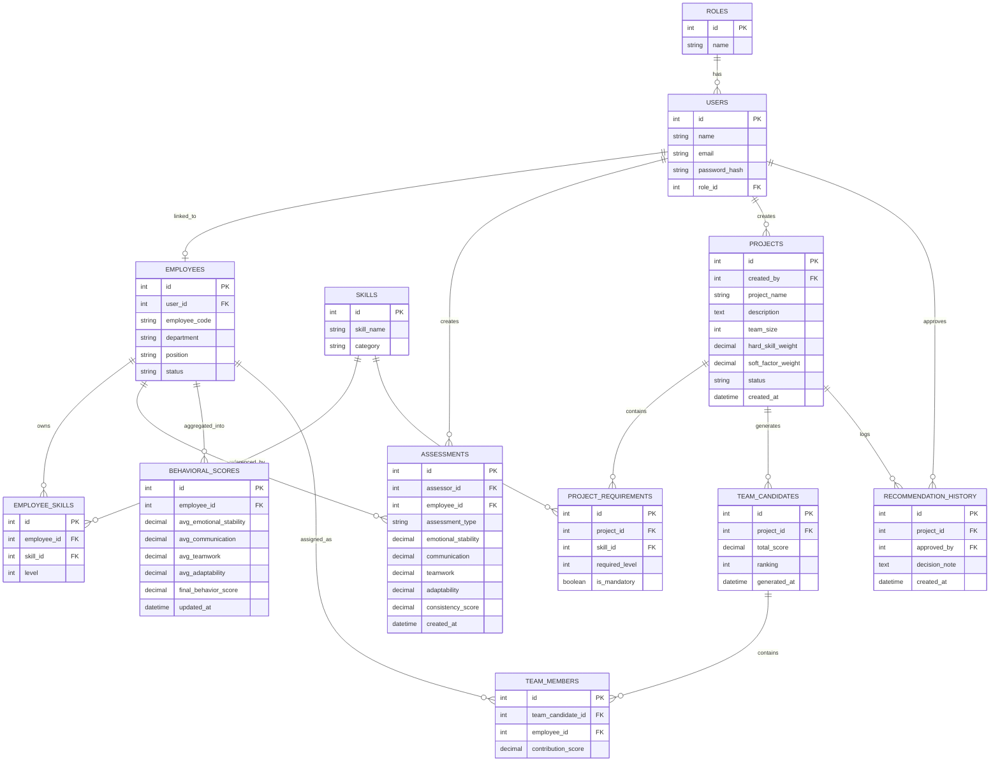

# Product Requirements Document (PRD)

## KiCob - Behavioral DSS for Strategic Team Composition

**Platform:** Web Application
**UI Theme:** Blue Glass / Glassmorphism

---

## 1. Overview

KiCob adalah sistem Decision Support System (DSS) berbasis web yang membantu manajer menyusun komposisi tim proyek secara lebih objektif, terukur, dan transparan. Sistem ini dirancang untuk mengurangi bias kognitif dalam pengambilan keputusan, terutama **Liking Bias** dan **Halo Effect**, dengan memanfaatkan data kompetensi teknis dan data perilaku sosial-emosional karyawan.

KiCob menggabungkan **Hard Skills** dan **Soft Factors** ke dalam proses rekomendasi tim. Hasil akhir tidak hanya berupa ranking kandidat, tetapi juga penjelasan alasan pemilihan agar keputusan dapat dipahami dan dipertanggungjawabkan.

### Product Goal

Membantu manajer membentuk tim proyek yang paling sesuai berdasarkan data, bukan berdasarkan subjektivitas pribadi.

### Target Users

* Manajer / Team Leader
* HR / Talent Management
* Karyawan / Reviewer
* Admin Sistem

### Problem Statement

Pembentukan tim sering kali dipengaruhi preferensi personal dan penilaian yang tidak konsisten. Akibatnya, komposisi tim dapat tidak seimbang dari sisi kompetensi maupun kecocokan kerja sama. KiCob hadir untuk memberikan alat bantu keputusan berbasis data agar pembentukan tim lebih adil dan efektif.

---

## 2. Requirements

### 2.1 Functional Requirements

1. Sistem harus menyediakan login dan role-based access control.
2. Sistem harus memungkinkan pengelolaan data karyawan.
3. Sistem harus memungkinkan pengelolaan data skill dan level kompetensi.
4. Sistem harus menerima penilaian perilaku dari beberapa sumber, seperti self, peer, dan supervisor.
5. Sistem harus menyediakan pembuatan proyek beserta kebutuhan skill yang diperlukan.
6. Sistem harus memungkinkan pengaturan bobot hard skill dan soft factor.
7. Sistem harus menghitung skor kecocokan kandidat berdasarkan aturan pembobotan.
8. Sistem harus menghasilkan rekomendasi komposisi tim.
9. Sistem harus menampilkan alasan dan breakdown skor rekomendasi.
10. Sistem harus menyimpan riwayat keputusan dan hasil rekomendasi.
11. Sistem harus menampilkan dashboard analitik ringkas.

### 2.2 Non-Functional Requirements

1. Antarmuka harus responsif dan mudah digunakan.
2. Sistem harus aman melalui autentikasi dan otorisasi.
3. Sistem harus cepat dalam menghitung rekomendasi untuk data skala kecil hingga menengah.
4. Sistem harus mudah dikembangkan secara modular.
5. Sistem harus memiliki keterjelasan hasil rekomendasi (explainability).
6. Sistem harus menjaga konsistensi dan integritas data.

### 2.3 Business Rules

1. Rekomendasi hanya dapat dibuat jika data proyek sudah lengkap.
2. Total bobot hard skill dan soft factor harus 100%.
3. Karyawan dengan nilai minimum tertentu dapat difilter dari rekomendasi.
4. Penilaian dari beberapa sumber dapat digabungkan menjadi skor akhir.
5. Manajer dapat menerima, menolak, atau menyesuaikan hasil rekomendasi.

---

## 3. Core Features

### 3.1 Employee Management

* Tambah, ubah, hapus, dan lihat data karyawan.
* Simpan profil dasar, departemen, dan posisi.
* Simpan data skill dan level penguasaan.

### 3.2 Behavioral Assessment

* Input self-assessment.
* Input peer assessment.
* Input supervisor assessment.
* Agregasi nilai perilaku dari berbagai sumber.

### 3.3 Project Management

* Buat proyek baru.
* Tentukan jumlah anggota tim.
* Tentukan skill yang dibutuhkan.
* Atur bobot hard skill dan soft factor.

### 3.4 Recommendation Engine

* Hitung skor hard skill.
* Hitung skor soft factor.
* Hitung skor total.
* Ranking kandidat.
* Susun tim kandidat terbaik.

### 3.5 Explainability and Analytics

* Tampilkan alasan pemilihan kandidat.
* Tampilkan komponen skor per faktor.
* Tampilkan visual perbandingan kandidat.
* Tampilkan riwayat hasil keputusan.

### 3.6 Audit Trail

* Simpan hasil rekomendasi.
* Simpan keputusan manajer.
* Simpan catatan perubahan parameter dan bobot.

### 3.7 Master Data Management

* **Skill Master**: Kelola daftar keahlian (hard & soft skills) secara terpusat.
* **Kategori Skill**: Klasifikasi keahlian untuk memudahkan pencarian dan filter.
* **Departemen & Posisi**: Pengelolaan data referensi organisasi.


---

## 4. User Flow

### 4.1 Flow Manajer

1. Login ke sistem.
2. Pilih atau buat proyek.
3. Isi kebutuhan skill dan jumlah anggota tim.
4. Atur bobot penilaian.
5. Sistem memproses data karyawan.
6. Sistem menghasilkan rekomendasi komposisi tim.
7. Manajer meninjau skor dan alasan rekomendasi.
8. Manajer menyetujui atau menyesuaikan hasil.
9. Sistem menyimpan keputusan ke riwayat.

### 4.2 Flow HR

1. Login ke sistem.
2. Tambah atau perbarui data karyawan.
3. Input skill dan data kompetensi.
4. Validasi data.
5. Simpan ke database.

### 4.3 Flow Reviewer

1. Login ke sistem.
2. Pilih karyawan yang akan dinilai.
3. Isi formulir assessment.
4. Submit penilaian.
5. Sistem menyimpan data mentah penilaian.
6. Sistem memperbarui skor agregat.

---

## 5. Architecture

### 5.1 High-Level Architecture



### 5.2 System Layers

* **Presentation Layer:** dashboard, form, tabel, grafik
* **Application Layer:** auth, employee management, project management, assessment, recommendation
* **Logic Layer:** scoring engine, weighting engine, compatibility logic
* **Data Layer:** PostgreSQL + Drizzle ORM

### 5.3 UI Direction

* Dominan warna biru
* Glassmorphism cards
* Blur effect
* Rounded corners besar
* Shadow lembut
* Tampilan modern, bersih, dan fokus pada data

## 6. Database Schema

### 6.1 Entity Relationship Diagram



### 6.2 Logical Tables

* roles
* users
* employees
* skills
* employee_skills
* assessments
* behavioral_scores
* projects
* project_requirements
* team_candidates
* team_members
* recommendation_history

### 6.3 ERD Notes

* **Assessments** menyimpan data mentah penilaian.
* **Behavioral_Scores** menyimpan hasil agregasi penilaian perilaku.
* **Team_Candidates** menyimpan alternatif tim yang direkomendasikan.
* **Team_Members** menyimpan anggota pada masing-masing kandidat tim.
* Struktur ini memastikan sistem tidak hanya meranking individu, tetapi benar-benar menyusun komposisi tim.

---

## 7. Tech Stack

### Fullstack Framework

* Next.js (App Router)

### Authentication

* Better Auth

### Database & ORM

* PostgreSQL
* Drizzle ORM
* Drizzle Kit

### Frontend UI

* Tailwind CSS
* shadcn/ui
* Framer Motion

### Visualization

* Recharts

### Validation & Forms

* Zod
* React Hook Form

### Dev Tools

* TypeScript
* GitHub
* Postman
* Figma
* Docker (opsional)

## 8. Development Plan

### Phase 1 - MVP Foundation

* Setup Next.js project
* Setup Better Auth
* Setup PostgreSQL + Drizzle
* Implement role access
* CRUD employee
* CRUD project
* Skill requirement input
* Basic scoring logic

### Phase 2 - Behavioral DSS

* Multi-source assessment
* Aggregation of behavioral data
* Weighted recommendation engine
* Team ranking
* Explainability output

### Phase 3 - Dashboard & Audit

* Analytical dashboard
* Recommendation history
* Approval flow
* Export laporan

### Phase 4 - Advanced Improvement

* Bias detection indicator
* Optimization algorithm for team composition
* Integration with larger HR data
* Predictive team success model
* Bias detection indicator
* Optimization algorithm for team composition
* Integration with larger HR data
* Predictive team success model

---

## 9. Visual Product Concept

### Main Dashboard Layout

```text
┌──────────────────────────────────────────────────────────────┐
│ KiCob                                                │
├──────────────────────────────────────────────────────────────┤
│ Sidebar │ KPI Cards                                          │
│         │ ┌──────────┐ ┌──────────┐ ┌──────────┐            │
│         │ │ Team Fit │ │ Bias Warn│ │ Top Score│            │
│         │ └──────────┘ └──────────┘ └──────────┘            │
│         │                                                    │
│         │ Recommendation Table                               │
│         │ ┌───────────────────────────────────────────────┐  │
│         │ │ Employee │ Hard Skill │ Soft Factor │ Score   │  │
│         │ └───────────────────────────────────────────────┘  │
│         │                                                    │
│         │ Chart / Radar / Compatibility Visualization        │
└──────────────────────────────────────────────────────────────┘
```

### Blue Glass UI Style Guide

* Background: deep blue gradient or soft blue blur
* Cards: semi-transparent glass panels
* Borders: subtle light-blue outline
* Typography: clean sans-serif
* Buttons: rounded, modern, glowing blue accent
* Charts: minimal, readable, high contrast

---

## 10. Conclusion

KiCob adalah web-based DSS yang dirancang untuk membantu pembentukan tim proyek secara objektif dengan menggabungkan hard skills, soft factors, dan data perilaku kolaboratif. Dengan stack modern seperti Next.js, Better Auth, dan Drizzle, sistem ini menjadi lebih ringkas, type-safe, dan mudah dikembangkan sebagai prototipe akademik maupun produk awal yang dapat diperluas ke tahap implementasi lebih lanjut.

---

## 11. Implementation Status

### Phase 1: Frontend Prototype (Completed)

1.  **Authentication UI**: 
    - Login page with standard Email & Password form.
    - Custom animated SVG representing DSS logic.
2.  **Dashboard & Analytics**:
    - High-level KPI cards (Total Employees, Skills, Projects).
    - Recent assessment and project activities overview.
3.  **Employee & Skill Management**:
    - Functional list with Search and Filter capabilities.
    - Dynamic Dialogs for Adding/Editing Employees and Skills.
4.  **Behavioral Assessment Form**:
    - Complete multi-criteria assessment form (Self, Peer, Supervisor).
    - Real-time scoring calculation and descriptive evaluation.
5.  **Project & Team Recommendation UI**:
    - Detailed project requirement view.
    - Visual ranking of team candidates with score breakdown.

### Phase 2: Backend & Logic Integration (Completed)

1.  **Database Implementation**: PostgreSQL + Drizzle ORM fully integrated with Supabase.
2.  **Server Actions & API Routes**: 
    - Full CRUD for Employees, Projects, and Skills.
    - Automated background recalculation of behavioral scores upon new assessment submission.
3.  **Advanced DSS Logic**:
    - SAW (Simple Additive Weighting) algorithm implemented on server-side.
4.  **Security & RBAC**:
    - Role-based assessment restrictions.
    - Prevention of duplicate assessments per period.

### Phase 3: Project Lifecycle & Periodic Assessment (Completed)

1.  **Periodic Evaluation**:
    - Support for monthly/quarterly assessments.
    - Dynamic period generation based on real-time date.
2.  **Automated Project Workflow**:
    - Project status automatically transitions from Draft to Active upon approval.
    - Manual "Selesaikan Proyek" action added.
3.  **Data Persistence & Cleanup**:
    - Atomic database updates when making decisions.
    - Automated cleanup of temporary data.

### Next Steps

1.  **Deployment**: Production deployment to Vercel.
2.  **Audit & Export**: Implementing CSV/PDF export for reports.
3.  **Predictive Model**: Enhancing DSS with predictive success metrics.

